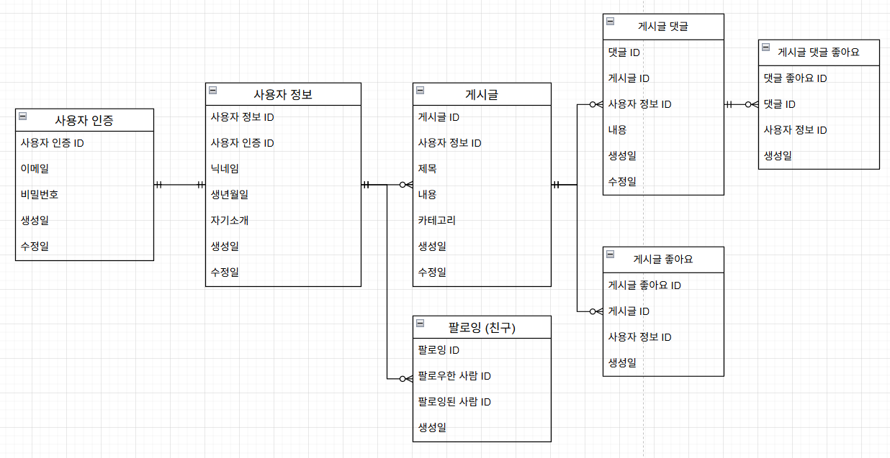
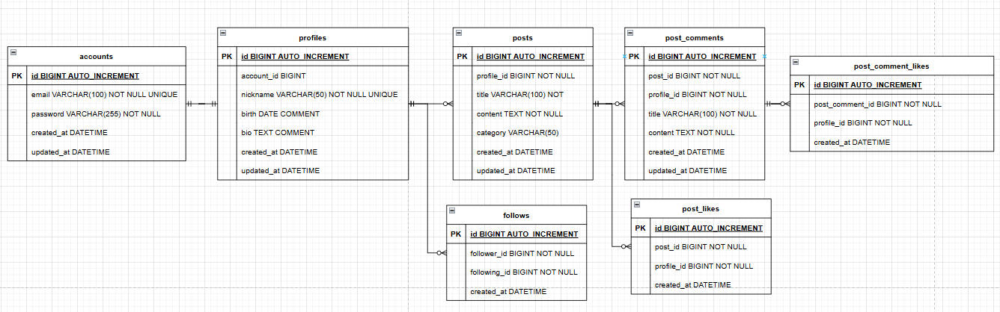
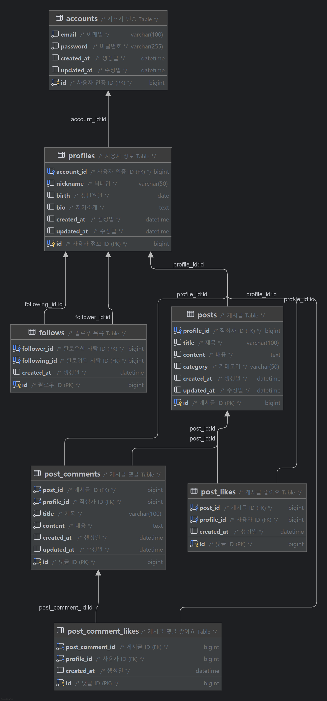

# 피다(Feeda)
개발자, 학생, 그리고 자기 계발에 관심 있는 모두가 모여 서로의 스터디 정보와 노하우를 나누는 커뮤니티 SNS입니다.

- 스터디 모집 및 경험 공유
- 질문과 답변을 통한 지식 나눔
- 성장과 동기부여를 위한 소통 공간
- 함께 배우고, 함께 성장하는 즐거움을 경험 시켜 드릴수가 있을 것 같습니다.

<br>

## 👨‍💻 Team
- 팀명: 6pring (식스프링)
- 소개: 4명의 아기자기한 팀
- 팀원 및 역할 분담

| 이름  | 역할 | 주요 담당 업무                                                       |
|-----|----|----------------------------------------------------------------|
| 최경진 | 팀장 | - 발표<br>- 프로필 관련 API 개발<br>- 게시글 댓글 관련 API 개발                  |
| 김나경 | 팀원 | - ERD 작성 및 DB 설계<br>- Auth 관련 API 개발<br>- 게시글 댓글 좋아요 관련 API 개발 |
| 안요한 | 팀원 | - 와이어 프레임 작성<br>- 게시글 관련 API 개발<br>- 게시글 좋아요 관련 API 개발         |
| 이의현 | 팀원 | - API 명세서 작성<br>- 팔로우(친구 관리) 관련 API 개발<br>- 전역 예외 처리 핸들어 개발    |


<br>

## 🛠 사용 기술
- Java 17
- Spring Boot 3.5.0
- Spring Data JPA (Hibernate 6.6.13.Final)
- Spring Security
- MySQL 8.0 이상
- Redis Cloud

<br>

## 💻 개발 도구
- IntelliJ IDEA
- Redis Insight
- Git
- Postman

<br>

## 📃 프로젝트 설계
<details>
<summary>API 명세서</summary>

Postman: [document](https://documenter.getpostman.com/view/44635744/2sB2qgeyJ7)

Notion
- [필수기능 명세서](https://www.notion.so/2002dc3ef5148050b741cdfba818f530?pvs=21)
- [도전기능 명세서](https://www.notion.so/2022dc3ef51481939541e86c62aa7864?pvs=21)
</details>

<details>
<summary>와이어 프레임</summary>


</details>

<details>
<summary>DB 설계</summary>

- 개념적 설계:
  - 
- 논리적 설계(ERD):
  - 
- 물리적 설계(SQL):
  - [newsFeed2.sql](./newsFeed2.sql)
  - 
</details>

<br>

## 📁 폴더 구조
```bash
src
├──── main.java.com.example.feeda
│  ├──── config         # 설정 관련
│  ├──── domain         # 도메인별 기능 분류
│  │  ├──── account
│  │  ├──── comment
│  │  ├──── follow
│  │  ├──── post
│  │  └──── profile
│  ├──── exception      # 예외 클래스 및 처리
│  ├──── filter         # 인증 필터
│  ├──── security       # 보안 관련 (PasswordEncoder, JWT)
│  └──── FeedaApplication.java
└──── test   # 테스트 코드
```

<br>

## 🔍 새로운 지식


## 🧰 문제 해결 (트러블 슈팅)


